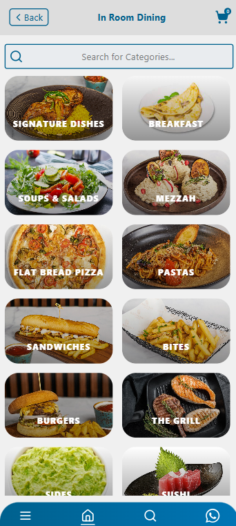
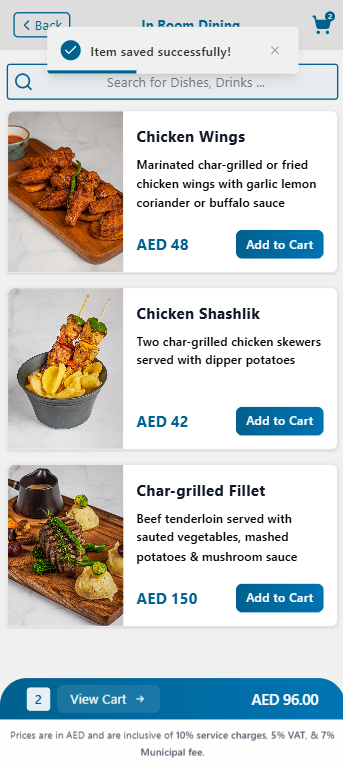
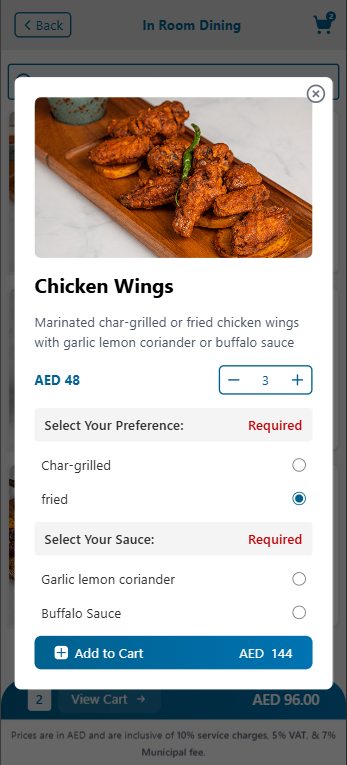

# In-Room dining System

A modern In-Room dining ordering system built with React, TypeScript, and Vite.


## Features

- ⚛️ React 19 with TypeScript type safety
- 🎨 Tailwind CSS for modern styling
- 🔄 React Router for navigation
- 📦 Context API for state management
- 📱 Responsive mobile-first design

## Getting Started

### Prerequisites

- npm 9+ or yarn 1.22+

### Installation

1. Clone the repository:

```bash
git clone https://github.com/MajdSoubh/Room-Dining.git
cd Room-Dining
```

2. Install dependencies:

```bash
npm install
# or
yarn
```

3. Create environment file (this .env file will contain the api endpoint base URL):

```bash
cp .env.example .env
```

4. Start development server:

```bash
npm run dev
# or
yarn dev
```

The app will be running at http://localhost:5173

## Screen Shots

<p align="center">



</p>
